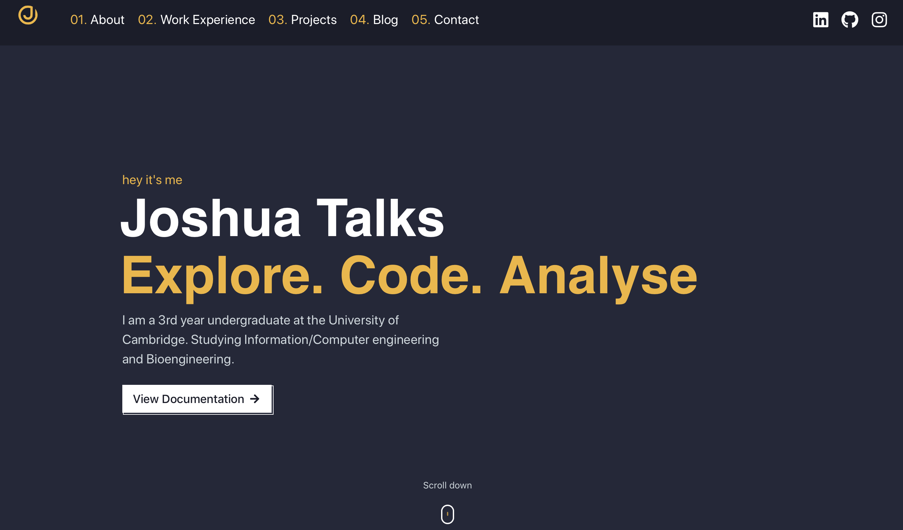

  

<h1 align="center">
  Joshua Talks Portfolio Website
</h1>

<h4>
  A minimalistic, responsive and easily configurable <a href="https://github.com/gatsbyjs/gatsby" target="_blank">Gatsby</a> portfolio website based on a starter made by <a href="https://github.com/Knochenmark" target="_blank">Knochenmark</a>.
</h4>

# My Experience modifying the Website

Before starting this small project I had some web development experience having spent a summer working as a Test intern to develop a web based interactive data analyse and visulisation dashboard for <a href="https://www.pragmatic.tech" target="_blank">PragmatIC</a>. I created this dashboard using a Python based Django web-frame work and it had introduced to me and developed my practical website building skills using HTML, CSS and JavaScript. As it turned out JavaScript was unnecessary for the modification of this website.

I started off by spending the afternoon going through the whole <a href="https://github.com/gatsbyjs/gatsby" target="_blank">Gatsby</a> tutorial as a way of introducing myself to this new frame work. It is a fantastic tutorial that teaches the fundamentals of modern WebDev and goes through the basics of React, enabling me to modify the website.

Modifying the content of the website was easy enough, Gatsby's Content Management System using GraphQL means pages are automatically created from your Markdown files within folders. So a lot of the work was already done and it was just about personalising the website information to myself. 

There was an extra section that I wanted to add to the website, this being my Work experience section. There was a bit of React work to set up the navigation links on the search bar and to also customise the layout of the work experince display box to allow me to layout my information in the way I wanted to. This involved editing the description tags in the cards.js file to allow HTML tags in the Markdown file.

I was also introduced to the concept of Scalable Vector Graphics (SVG), in particular, SVG paths. In short, SVG paths are basically a way to draw graphics on the fly. So, instead of loading an image like a JPEG, it's actually taking a sequence of instructions and drawing the graphics out. I used this neat <a href="https://convertio.co/jpg-svg/" target="_blank">website</a> to convert a J logo for the  into an SVG path.

